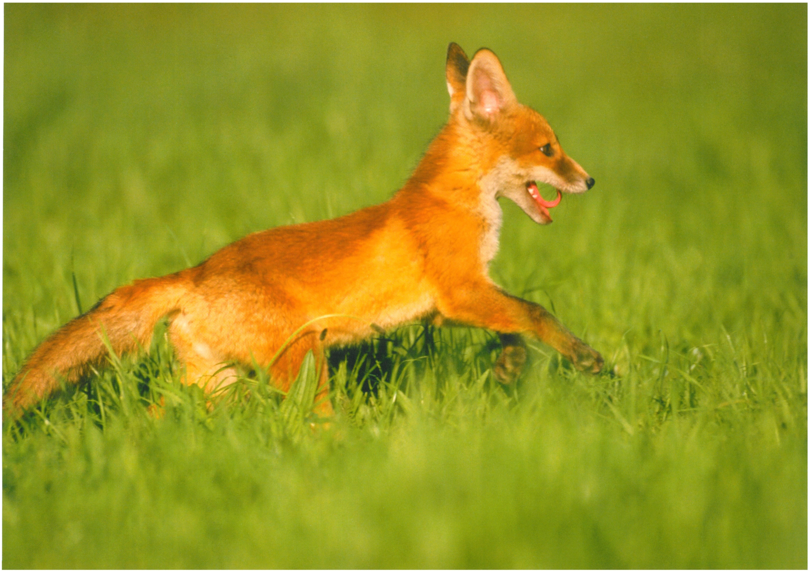

# Willkommen!

Hi 👋🏻 Schön, dass Du hier gelandet bist. Mein Name ist Leonid und ich mache ganz viele verschiedene Dinge. Und begeistere mich ständig für Neues. Das ist eine Sammlung von Dokumenten und interessanten Informationen, die ich im Laufe der Zeit sammle und hier mit anderen Menschen teile.

## Themenüberblick

Worüber werde ich hier schreiben? Also zuerst: Es ist kein Blog hier, sonder einfach eine Sammlung an Informationen, die ich für mich nützlich finde und mit anderen teilen möchte. Ich schreibe einfach dazu, was mir wichtig ist.

* Podcasting
* Coaching
* Community Building
* Social Media
* Tech-Themen wie Coden, Git, ffmpeg
* Projektmanagement
* Wissensmanagement
* Business

## Mein Motto-Ziel

Motto-Ziele sind Ziele, die uns auf eine emotionale Weise motivieren sie zu verfolgen. Mein Ziel ist es meine Projekte und Aufgaben trotz Widerstände und Frust erfolgreich zu Ende zu bringen und dabei möglichst auch Spaß zu haben 🤘🏻 Mein Motto-Ziel sieht dabei so aus:

 > Ich möchte mich fühlen wie der kleine fröhliche Fuchs, der spielerisch und mutig die Welt entdeckt.

 Ich denke an dieses Motto-Ziel und an das untere Bildchen, wenn es gerade mal *tough* wird. Übrigens das Logo dieser Seite wurde auch davon inspiriert.

 

 Quelle des Bildes: [https://zrm.ch/OnlineTool_english.html](https://zrm.ch/OnlineTool_english.html)